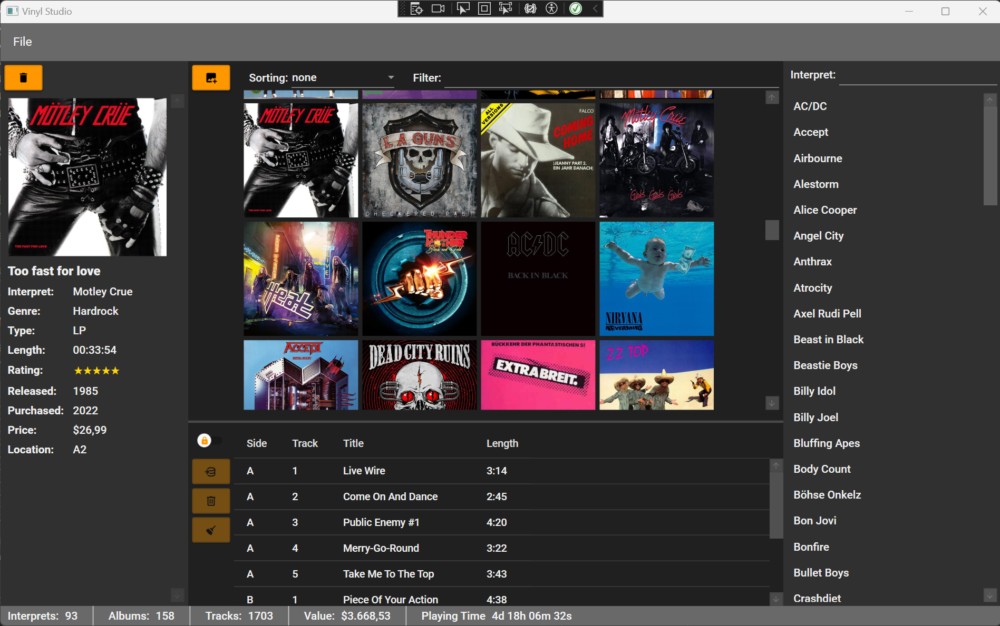

# VinylStudio

VinylStudio is an open source software that helps you managing your vinyl record collection.
It is not meant to be a audio player, but only a managing software which gives you an overview,
statistics, and search functionality in order to quickly find your desired piece of black gold.

## Installation

### Importing Data from Legacy System (VinylShelf)

## Navigation

### Thumbnail Panel

### Interpret Panel

### Detail Panel

### Track List Panel

## Sorting and Filtering Options

### Filtering Interprets

### Filtering Thumbnails

### Sorting options

## HowTo

### Creating new Albums

### Editing existing Albums

### Deleting albums

### Editing Track Lists

### Discogs Support

#### A Word about Discogs

#### Rertrieving Track Lists by Discogs

#### Retrieving Cover Images by Discogs