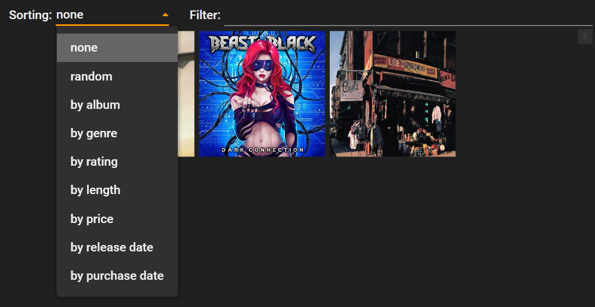

# VinylStudio

VinylStudio is an open source software that helps you managing your vinyl record collection.
It is not meant to be a audio player, but only a managing software which gives you an overview,
statistics, and search functionality in order to quickly find your desired piece of black gold.

## Table of Contents
* [Installation](#installation)
* [First Start](#first-start)
  * [Importing Data from Legacy System (VinylShelf)](#importing-data-from-legacy-system-VinylShelf) 
* [Navigation](#navigation)
  * [Thumbnail Panel](#thumbnail-panel)
  * [Interpret Panel](#interpret-panel)
  * [Detail Panel](#detail-panel)
  * [Track List Panel](#track-list-panel)
* [Sorting and Filtering Options](#sorting-and-filtering-options)
  * [Filtering Interprets](#filtering-interprets)
  * [Filtering Thumbnails](#filtering-thumbnails)
  * [Sorting options](#sorting-options)
* [How-To](#how-to)
  * [Creating new Albums](#creating-new-albums)
  * [Editing existing Albums](#editing-existing-albums)
  * [Deleting albums](#deleting-albums)
  * [Editing Track Lists](#editing-track-lists)
* [Discogs Support](#discogs-support)
  * [A Word about Discogs](#a-word-about-discogs)
  * [Retrieving Track Lists by Discogs](#retrieving-track-lists-by-discogs)
  * [Retrieving Cover Images by Discogs](#retrieving-cover-images-by-discogs)

## Installation
*to be done*

## First Start
When you start VinylStudio for the first time, it asks you for a Discogs token. Please refer
to the chapter [A Word about Discogs](#a-word-about-discogs) for more information about this.

if you don't want or need Discogs support at the moment, you can dismiss this dialog by just pressing
*cancel*. 

### Importing Data from Legacy System (VinylShelf)
If you have used the legacy system "VinylShelf" before, you can migrate your old database to
the new format of VinylStudio. Choose *File* -> *Migration* -> *Migrate from VinylShelf 0.2* 
from the main menu.

Be aware: if you have already entered data into VinylStudio, the migration will delete all
these data and overwrite it with the migrated data!

After this security warning a file selection dialog opens up. Select the file *database.json*
from your VinylShelf installation. Most probably you'll find this file in the directory

    ~\.VinylShelf\data\database.json

whereat the tilde symbolizes your home directory.

Typically this should work without any problems. After the migration you have all your data
and cover thumbnails copied (and converted) to the directory where you have installed
VinylStudio.

## Navigation

Navigation in VinylStudio is more or less self-explaining.

The main window of the application is divided into four sections.

### Thumbnail Panel

In the top middle of the window you'll see the thumbnail panel.

If you already have some albums entered into your database, you'll find  the thumbnails
of these album in the thumbnail panel.

Click on a thumbnail in order to show the details of the album in the detail panel. For
[editing](#editing-existing-albums)
an existing album, you have to double click on the thumbnail.

There are numerous ways of filter and ordering options that affect the thumbnails shown
in the thumbnail panel. These options are described in the chapter 
[Sorting and Filtering Options](#sorting-and-filtering-options) in more detail.

The orange button in the top left corner of the thumbnail panel is used to 
[create a new album](#creating-new-albums).

### Interpret Panel
In the top right you can see the interpret panel.

The interpret panel initially shows you all interprets present in your database, regardless
if there are albums for this interpret stored or not.

However, the interpret panel can be filtered, too. This is described in the chapter
[Filtering Interprets](#filtering-interprets).

### Detail Panel
In the top left you can see the detail panel.

If you have selected an album in the thumbnail panel, the details are automatically
shown in the detail panel. 

This panel might automatically change its size, when it needs more room to show a property, e.g.
the title of the album.

### Track List Panel
In the bottom middle you'll see the track list panel.

This table shows you the tracks and some usefull information of the currently selected album.
In the chapter [Editing Track Lists](#editing-track-lists) you find some information on how
to edit and create track lists for an album.

## Sorting and Filtering Options
The sorting and iltering options of VinylStudio gives you all the possibilities to 
find what you're looking for.

### Filtering Interprets
When your list of interprets is quite big and your looking for a specific band or singer
and don't want to scroll through this big list, you can simply enter a search string in the
text field at the top of the panel.

The list of the interprets is then reduced to those interprets which name contains the entered
search string. If you want to reset this filter and show all your interprets again, just delete the
search string in the filter text field.

**Important:** in order to set the filter you have to press the *enter* or the *tab* key.

### Filtering Thumbnails
Thumbnails can be filtered on different ways.

First, if you click on an interpret in the interpret panel, this interpret is selected and only
albums of this interpret are shown in the thumbnail panel. In order to reset the selection,
just click again on the selected interpret while holding down the *Ctrl* or *Strg* key of your
keyboard.

Another way of filtering the thumbnails is achieved by setting an interpret filter. 

If you set a filter, the interpret list is reduced to the matching interprets 
(see [Filtering Interprets](#filtering-interprets)). The thumbnail panel only shows albums
of these artists currently shown in the interpret panel.

You can also use a thumbnail filter to reduce the number of shown albums in the thumbnail panel.

Just enter a search string into the filter text box at the top of the panel and press the
*tab* key to set the filter. Only albums which name contain the entered search string will
be shown.

As in the interpret filter, you can reset this by deleting the search string in the 
filter text box.

### Sorting options
The order of the thumbnail display can be affected by the *sorting* combobox at the upper top
of the panel.

Select any of the given options to re-arrange the order.

## How-To
The HowTo's give you a quick overview on how to perform a desired action.

### Creating new Albums
You can add a new album by clicking on the *add new album* button at the upper left of the
thumbnail panel:

This opens a new dialog where you can enter all data for the album:

You have to fill out all fields in this dialog, otherwise you won't be able to
save it.

Genre and Interpret can be choosen by the combo boxes. If you need to have a new interpret
or a new genre, you can add those by clicking on the *plus* buttons at the right side of the
combo boxes.

To set a cover image, click on the *load from disc* button on the left. A file selection
dialog appears where you can select a jpeg file from your local hard drive. The selected
image will be scaled and then copied to your database.

With the *Discogs query* button you can also import a cover image from the
Discogs. Please refer to the chapter [Discogs Support](#discogs-support) for more
information about this.

**Important**: the price text field is kind of special! As the name implies, you can
set the price of this record, but you have to enter it in that way, your locale settings
of your computer implies.

While the decimal separator in the US is a dot (.), you may live in a country (and have
your computer set up for this country) where this is not the case. For example, in Germany you
would enter *29,29* instead of *29.99* - like you would do on a computer set up
for the locale of the United States.

### Editing existing Albums
You can easily edit existing albums by double clicking on the thumbnail of the album in 
the thumbnail panel.

In this case the same dialog opens at it would do when adding a new album.

### Deleting albums
For deleting an existing album you have to choose this album in the thumbnail panel.
The details of the album are shown in the detail panel at the left.

To delete the album, just click on the *delete selected album* button ath the top of the
panel:

### Editing Track Lists
You can edit track lists of albums inside the track list panel in the lower middle:

Track lists are locked by default, so that you cannot accidently trash your database.
For editing you have to disable locking, first:

When unlocked, you can directly edit the data in the track list table.

For adding a new track, scroll to the bottom of the list and enter some valid
values in the empty line at the bottom:

With the *delete all songs* button you can remove all songs from the track list:

When you want to delete only some of the songs, select them by clicking on the
desired song. You can use the *Ctrl* or *Shift* button to select multiple songs
at once. Then, click on the *delete selected songs* button:

You also can import a track list provided by Discogs by clicking the corresponding
button:

Please refer to the chapter 
[Retrieving Track Lists by Discogs](#retrieving-track-lists-by-discogs) for
detailed information.

### Discogs Support
VinylStudio provides support for quering data from the Discogs web service.

#### A Word about Discogs
When you start VinylStudio for the first time, it asks you for a Discogs token.

This (personal) token is essential if you want to use the Discogs support of
VinylStudio for importing cover images and track lists.

**Important:** You can still use VinylStudio without a Discogs token! But you
won't be able to automatically import track lists and cover images from Discogs,
but have to enter that stuff manually.

A personal Discogs token is completely free of charge. To get one, follow
these steps:

1. Go to the [Discogs website](https://www.discogs.com/)
2. Register as a new user
3. Click on your profile avatar and select *settings*
4. Then choose *Developer* from the list on the left side
5. Here you can create a new personal access token
6. Store this token and enter it in the Discogs dialog that appears at the first start of VinylStudio

To protect the Discogs infrastructure (servers), there's a limit for requesting data. You can just
send 60 requests per minute. If you exceed this limit, Discogs won't deliver any data
and a message box will ask you to wait for 60 seconds before sending another request.

#### Retrieving Track Lists by Discogs
When the track list of an album is unlocked you can use the *Import track list from Discogs* button 
to get a track liszt automatically:

Clicking on this button submits the title of the album and the name of the interpret to
Discogs and searches for releases that match this criteria. However, there can be many
releases. In Discogs each press of a record is a release, even if it contains absolutely the
same tracks.

The resulting list of found releases is limited to 10. This is because you just can send
a defined numebr of requests per minute to Discogs (at the moment it's 60 requests / minute) and
we don't want to get blocked for 60 seconds because we exceeded this limit.

The results are shown in a new dialog:

However, Discogs is feed by user input and not all release data and track lists are
*clean*. The first thing you should have a look at is the number or tracks. Does it 
contain the right number? Sometimes you will see a release with only 1 track, even though
the release has 10 songs. In this case you see at first sight that this Discogs record
is rubbish.

The next step is to move thew mouse over a release. A tooltip with the data of the+
release record will appear:

This tooltip contains three columns per line. In the first column you can see the position
of a track. The letter at the beginning says on which side of the vinyl record the song is
and the number behind is the index of the song on this side.

The next column contains the length of the song in minutes and seconds, followed by the name
of the song. 

As said before: sometime records are not good. Sometimes the position is not set or the
time is not set or there are missing songs. Although you can import those records you should
watch out for some valid ones, so that you don't have to enter the invalid or missing data
by yourself.

Importing a record is easy: just select the desired release by a click on it and click
the button *use selected release*. The *cancel* button leaves the dialog without importing
anything.

#### Retrieving Cover Images by Discogs
When editing an album you can set your own cover image or you can automatically request
user covers from Discogs. To do so, click on the *Discogs query* button in the album edit
dialog.

A new dialog appears:

In the upper combo box you have a list of up to 10 releases (see the section about the
limits of Discogs). If you select one of this releases, the first 4 images for this
release will be shown in the square fields under the combo box.

If you click on one of these images it will get a green border and is selected. You can now 
click on the save button and the image will be downloaded, scaled and stored in your
database.